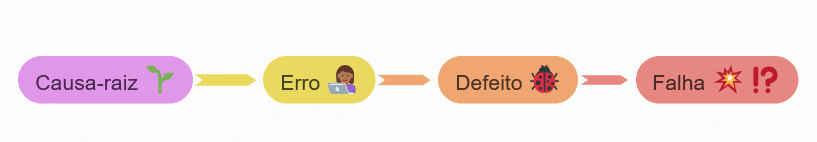

<b>Erro:</b> É qualquer equívoco produzido pelo ser humano, pode haver vários motivos como pressão de tempo, falta de treinamento, cansaço, processos mal estruturados, etc. Caso não detectado, pode produzir um Defeito.

<b>Defeito:</b> É produzido por um erro, e encontrado em produtos de trabalho como script de teste, documentação, especificação de requisitos, código-fonte, etc. Caso não detectado e quando executado, pode produzir uma falha.</b>

<b>Falha:</b> É produzida por um defeito ou condições ambientais, é quando o sistema deixa de fazer o que deveria ou faz algo que não deveria.

<b>Causa-raiz:</b> É a situação que leva o ser humano ao erro, ou seja, a principal causa do erro. Deve ser analisada quando uma falha ou defeito é detectado, e ao corrigí-la outras falhas e defeitos podem ser evitados ou ter a frequência menor. 

Segue o fluxo:

    

